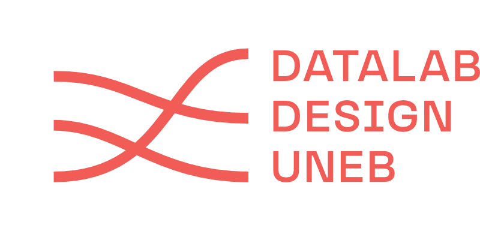

# Materiais Didáticos - Aulas

Este repositório contém materiais de apoio utilizados em cursos, oficinas e aulas ministradas pelo Professor Elias Bitencourt, da Universidade do Estado da Bahia (UNEB) e coordenador do Datalab Design. Os conteúdos são organizados em pastas específicas para cada evento ou aula, facilitando o acesso e a consulta.

## Estrutura do Repositório

O repositório é organizado em subpastas dedicadas a cada tema ou evento específico. Cada pasta contém arquivos, slides, exemplos práticos e tabelas relevantes, utilizados como suporte pedagógico.

### Pasta `Intro Analise de Redes`

- **Descrição**: Materiais de apoio para a aula Introdução a análise de redes - Aula 02: conhecendo o Gephi Lite - [Link para o vídeo no YouTube](https://youtu.be/OLSw2sN5btM).
- **Conteúdo**: Arquivos de rede e tabelas que permitem aos alunos praticar os exemplos demonstrados durante a aula.
- **Vídeo Tutorial**: A aula correspondente a este material está disponível no canal do Datalab Design no YouTube.
- **Objetivo**: Facilitar o aprendizado da interface e das funcionalidades do Gephi Lite, especialmente em contextos de ensino com recursos computacionais limitados.

### Pasta `Youtube Data Tools`

- **Descrição**: Materiais didáticos para o uso da ferramenta YouTube Data Tools (YTDT), desenvolvida por Bernhard Rieder, voltados para exercícios em sala de aula.
- **Conteúdo**:
  - Uma tabela com a síntese de cada módulo da ferramenta, facilitando a compreensão das funcionalidades disponíveis.
  - Um notebook  `Formatar Video e Channel ID Youtube Data Tools.ipynb`, criado para automatizar a formatação de IDs de vídeos e canais para uso com os módulos do YTDT. O notebook simplifica o processo ao permitir que os usuários copiem dados de IDs de canais ou vídeos diretamente da coluna do CSV, removam duplicatas e formatem as IDs separadas por vírgula como é exigido pelo YTDT.
- **Objetivo**: Fornecer recursos didáticos para o uso do YouTube Data Tools em análises de redes e dados digitais em sala de aula, poupando tempo e esforço na preparação dos dados necessários para a formatação das redes.

## Sobre o Datalab Design

O Datalab Design é um laboratório de pesquisa em visualização de dados e métodos digitais, vinculado ao curso de Design da Universidade do Estado da Bahia (UNEB) e coordenado pelo Professor Dr. Elias Bitencourt. Nossa metodologia combina design de visualização de dados, ciência de dados e as perspectivas teóricas dos estudos em ciência e tecnologia (STS). Essa abordagem permite explorar a relação entre mediações algorítmicas, plataformas digitais e fenômenos sociais contemporâneos.

O Datalab é um espaço criativo que promove a colaboração entre acadêmicos, estudantes, designers e cientistas de dados. Utilizamos dados digitais para entender fenômenos sociais mediados por serviços digitais e para desenvolver intervenções, ferramentas de pesquisa e projetos de inovação envolvendo a interação entre sociedade e tecnologias digitais.

## Sobre o Autor

Elias Bitencourt é Professor Adjunto no Curso de Design da Universidade do Estado da Bahia (UNEB), com Doutorado em Comunicação pela FACOM/UFBA e Mestrado em Cultura e Sociedade pelo IHAC/UFBA. Ele foi pesquisador visitante no Centro Milieux, no Canadá, em 2019, e atualmente coordena o Datalab/Design (CNPq) na UNEB, um centro de pesquisa focado em visualização de dados e metodologias digitais. Sua pesquisa abrange visualização de dados, estudos de plataformas, imaginários digitais e mediação algorítmica nas relações sociais. Elias também atua como pesquisador colaborador no Inova Media Lab (Universidade Nova de Lisboa) e na rede internacional Public Data Lab.

## Contribuição e Uso dos Materiais

Estes materiais foram desenvolvidos para apoiar atividades pedagógicas e podem ser utilizados em contextos de ensino e pesquisa, com créditos ao autor, laboratório e instituição. Para sugerir melhorias ou adicionar conteúdo, favor abrir um _pull request_ ou entrar em contato pelo canal de comunicação do Datalab Design.

## Links de Contato

- **Site do Datalab Design**: [https://datalabdesign.org/](https://datalabdesign.org/)
- **Canal no YouTube**: [https://www.youtube.com/channel/UCAO7VNbj2T42uHf0M-adT8g](https://www.youtube.com/channel/UCAO7VNbj2T42uHf0M-adT8g)
- **Instagram**: [https://www.instagram.com/datalabdesign/profilecard/?igsh=ZjB4czg5eGpxbzl5](https://www.instagram.com/datalabdesign/profilecard/?igsh=ZjB4czg5eGpxbzl5)

___
