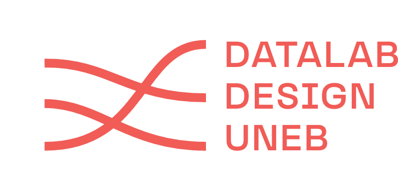

# Materiais de Apoio - Youtube Data Tools

Este diretório faz parte do repositório de materiais didáticos das aulas ministradas pelo Professor Elias Bitencourt, coordenador do Datalab Design na Universidade do Estado da Bahia (UNEB). Ele é dedicado a ferramentas e recursos didáticos complementares para exercícios práticos com a ferramenta YouTube Data Tools (YTDT) realizados nas disciplinas Intro. aos Métodos Digitais e Intro. à Visualização de Dados do curso de design (UNEB).

## Conteúdo dos Arquivos no Diretório

1. **`Sintese Youtube Data Tools.pdf`**  
   Uma tabela com a síntese detalhada de cada módulo da ferramenta YouTube Data Tools. O material apresenta os tipos de entrada e saída, exemplos de análises possíveis e combinações recomendadas entre os módulos, facilitando a familiarização com a ferramenta e e a experimentação da ferramenta em exercícícios realizados na disciplina.

2. **`Formatar Video e Channel ID Youtube Data Tools.ipynb`**  
   Um notebook Jupyter criado para simplificar e automatizar a formatação de IDs de vídeos e canais para uso nos módulos do YouTube Data Tools.  
   - **Funcionalidades**:
     - Formatação automática de listas de IDs conforme exigido pelos módulos, como `Channel List`, `Channel Network`, `Video List`, e `Video Co-Comment Network`.
     - Opção para remoção de duplicatas e contagem automática de IDs.
     - Geração de saídas prontas para uso direto na interface do YTDT.
   - **Objetivo**: Reduzir o esforço manual e aumentar a eficiência no uso da ferramenta em sala de aula.

## Sobre a Ferramenta YouTube Data Tools

O YouTube Data Tools (YTDT) é uma coleção de módulos desenvolvida por Bernhard Rieder para extrair dados da plataforma YouTube por meio da API v3, permitindo que pesquisadores coletem informações em formatos padrão para análises posteriores em outros softwares.

Rieder, B. (2015). YouTube Data Tools (Version 1.42) [Software]. Disponível em https://ytdt.digitalmethods.net.

## Para mais informações e acesso a outros materiais didáticos, consulte:

- **Site do Datalab Design**: [https://datalabdesign.org/](https://datalabdesign.org/)
- **Canal no YouTube**: [https://www.youtube.com/channel/UCAO7VNbj2T42uHf0M-adT8g](https://www.youtube.com/channel/UCAO7VNbj2T42uHf0M-adT8g)
- **Instagram**: [https://www.instagram.com/datalabdesign/profilecard/?igsh=ZjB4czg5eGpxbzl5](https://www.instagram.com/datalabdesign/profilecard/?igsh=ZjB4czg5eGpxbzl5)
